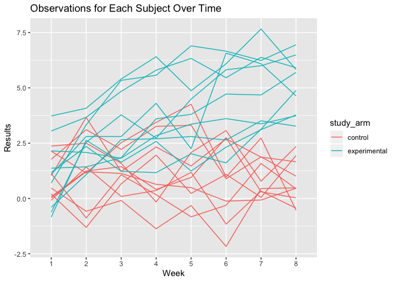
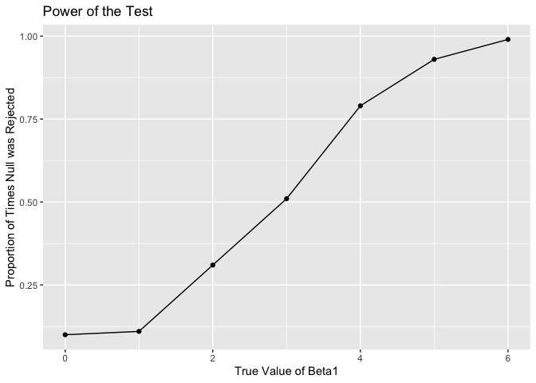
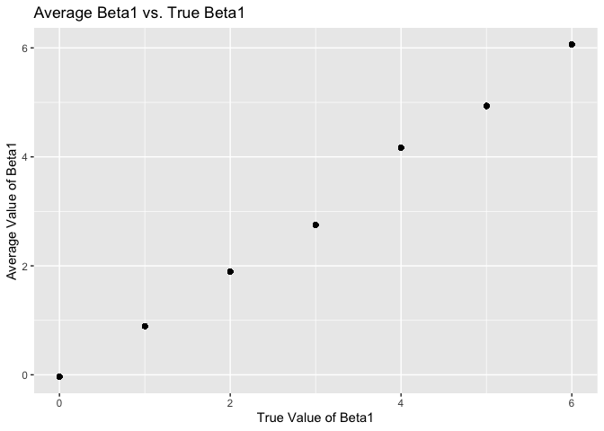
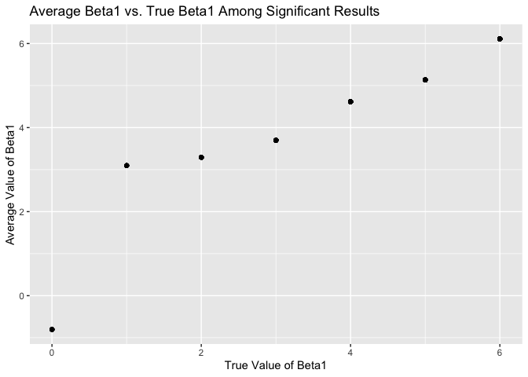

p8105\_hw\_5\_bw2595
================
Blair Wigsten
11/11/2019

# Problem 1

## Load packages and run code given

``` r
library(tidyverse)
```

    ## ── Attaching packages ─────────────────────────────────────── tidyverse 1.2.1 ──

    ## ✔ ggplot2 3.2.1     ✔ purrr   0.3.2
    ## ✔ tibble  2.1.3     ✔ dplyr   0.8.3
    ## ✔ tidyr   1.0.0     ✔ stringr 1.4.0
    ## ✔ readr   1.3.1     ✔ forcats 0.4.0

    ## ── Conflicts ────────────────────────────────────────── tidyverse_conflicts() ──
    ## ✖ dplyr::filter() masks stats::filter()
    ## ✖ dplyr::lag()    masks stats::lag()

``` r
library(readr)
library(purrr)

set.seed(10)

iris_with_missing = iris %>% 
  map_df(~replace(.x, sample(1:150, 20), NA)) %>%
  mutate(Species = as.character(Species))
iris_with_missing
```

    ## # A tibble: 150 x 5
    ##    Sepal.Length Sepal.Width Petal.Length Petal.Width Species
    ##           <dbl>       <dbl>        <dbl>       <dbl> <chr>  
    ##  1          5.1         3.5          1.4         0.2 setosa 
    ##  2          4.9         3            1.4         0.2 setosa 
    ##  3          4.7         3.2          1.3         0.2 setosa 
    ##  4          4.6         3.1          1.5        NA   setosa 
    ##  5          5           3.6          1.4         0.2 setosa 
    ##  6          5.4         3.9          1.7         0.4 setosa 
    ##  7         NA           3.4          1.4         0.3 setosa 
    ##  8          5           3.4          1.5         0.2 setosa 
    ##  9          4.4         2.9          1.4         0.2 setosa 
    ## 10          4.9         3.1         NA           0.1 setosa 
    ## # … with 140 more rows

## Fill in missing character and numeric values, and write a function that takes a vector as an argument

``` r
replaced_iris = function(x) {
  if(is.numeric(x)) {
    ifelse(is.na(x), mean(x, na.rm = TRUE), x)
  } else if (is.character(x)) {
    ifelse(is.na(x), "virginica", x)
  }
}

iris_full = map_df(iris_with_missing, replaced_iris)
iris_full
```

    ## # A tibble: 150 x 5
    ##    Sepal.Length Sepal.Width Petal.Length Petal.Width Species
    ##           <dbl>       <dbl>        <dbl>       <dbl> <chr>  
    ##  1         5.1          3.5         1.4         0.2  setosa 
    ##  2         4.9          3           1.4         0.2  setosa 
    ##  3         4.7          3.2         1.3         0.2  setosa 
    ##  4         4.6          3.1         1.5         1.19 setosa 
    ##  5         5            3.6         1.4         0.2  setosa 
    ##  6         5.4          3.9         1.7         0.4  setosa 
    ##  7         5.82         3.4         1.4         0.3  setosa 
    ##  8         5            3.4         1.5         0.2  setosa 
    ##  9         4.4          2.9         1.4         0.2  setosa 
    ## 10         4.9          3.1         3.77        0.1  setosa 
    ## # … with 140 more rows

  - The resulting function replaces all missing character values with
    “virginica”, and replaces all missing numeric values with the mean
    of non-missing values. The function is applied to the columns of the
    missing dataset using a map statement.

# Problem 2

## Start with a dataframe containing all file names

``` r
data = tibble(
  observation = list.files(path = "./data")
)
data
```

    ## # A tibble: 20 x 1
    ##    observation
    ##    <chr>      
    ##  1 con_01.csv 
    ##  2 con_02.csv 
    ##  3 con_03.csv 
    ##  4 con_04.csv 
    ##  5 con_05.csv 
    ##  6 con_06.csv 
    ##  7 con_07.csv 
    ##  8 con_08.csv 
    ##  9 con_09.csv 
    ## 10 con_10.csv 
    ## 11 exp_01.csv 
    ## 12 exp_02.csv 
    ## 13 exp_03.csv 
    ## 14 exp_04.csv 
    ## 15 exp_05.csv 
    ## 16 exp_06.csv 
    ## 17 exp_07.csv 
    ## 18 exp_08.csv 
    ## 19 exp_09.csv 
    ## 20 exp_10.csv

  - The “data” set lists all files contained in the zip
file.

## Iterate over file names and read in data for each subject and save the result as a new variable in the dataframe and tidy the resulting dataset

``` r
data = function(path){
  case_control = read_csv(path)
  case_control
} 

directory = "./data"
study = tibble(
  participant = list.files(path = "./data"),
  files = str_c(directory, "/", participant)) %>%
  mutate(
    weekly_data = map(files, read_csv),
    participant = str_replace(participant, ".csv", "")) %>%
  unnest() %>%
  mutate(
  study_arm = if_else(participant %in% c("con_01", "con_02", "con_03", "con_04", "con_05", "con_06", "con_07", "con_08", "con_09", "con_10"), "control", participant),
  study_arm = if_else(participant %in% c("exp_01", "exp_02", "exp_03", "exp_04", "exp_05", "exp_06", "exp_07", "exp_08", "exp_09", "exp_10"), "experimental", study_arm)) %>%
  pivot_longer(
    week_1:week_8,
    names_to = "week", 
    names_prefix = "week_", 
    values_to = "result")
```

    ## Parsed with column specification:
    ## cols(
    ##   week_1 = col_double(),
    ##   week_2 = col_double(),
    ##   week_3 = col_double(),
    ##   week_4 = col_double(),
    ##   week_5 = col_double(),
    ##   week_6 = col_double(),
    ##   week_7 = col_double(),
    ##   week_8 = col_double()
    ## )
    ## Parsed with column specification:
    ## cols(
    ##   week_1 = col_double(),
    ##   week_2 = col_double(),
    ##   week_3 = col_double(),
    ##   week_4 = col_double(),
    ##   week_5 = col_double(),
    ##   week_6 = col_double(),
    ##   week_7 = col_double(),
    ##   week_8 = col_double()
    ## )
    ## Parsed with column specification:
    ## cols(
    ##   week_1 = col_double(),
    ##   week_2 = col_double(),
    ##   week_3 = col_double(),
    ##   week_4 = col_double(),
    ##   week_5 = col_double(),
    ##   week_6 = col_double(),
    ##   week_7 = col_double(),
    ##   week_8 = col_double()
    ## )
    ## Parsed with column specification:
    ## cols(
    ##   week_1 = col_double(),
    ##   week_2 = col_double(),
    ##   week_3 = col_double(),
    ##   week_4 = col_double(),
    ##   week_5 = col_double(),
    ##   week_6 = col_double(),
    ##   week_7 = col_double(),
    ##   week_8 = col_double()
    ## )
    ## Parsed with column specification:
    ## cols(
    ##   week_1 = col_double(),
    ##   week_2 = col_double(),
    ##   week_3 = col_double(),
    ##   week_4 = col_double(),
    ##   week_5 = col_double(),
    ##   week_6 = col_double(),
    ##   week_7 = col_double(),
    ##   week_8 = col_double()
    ## )
    ## Parsed with column specification:
    ## cols(
    ##   week_1 = col_double(),
    ##   week_2 = col_double(),
    ##   week_3 = col_double(),
    ##   week_4 = col_double(),
    ##   week_5 = col_double(),
    ##   week_6 = col_double(),
    ##   week_7 = col_double(),
    ##   week_8 = col_double()
    ## )
    ## Parsed with column specification:
    ## cols(
    ##   week_1 = col_double(),
    ##   week_2 = col_double(),
    ##   week_3 = col_double(),
    ##   week_4 = col_double(),
    ##   week_5 = col_double(),
    ##   week_6 = col_double(),
    ##   week_7 = col_double(),
    ##   week_8 = col_double()
    ## )
    ## Parsed with column specification:
    ## cols(
    ##   week_1 = col_double(),
    ##   week_2 = col_double(),
    ##   week_3 = col_double(),
    ##   week_4 = col_double(),
    ##   week_5 = col_double(),
    ##   week_6 = col_double(),
    ##   week_7 = col_double(),
    ##   week_8 = col_double()
    ## )
    ## Parsed with column specification:
    ## cols(
    ##   week_1 = col_double(),
    ##   week_2 = col_double(),
    ##   week_3 = col_double(),
    ##   week_4 = col_double(),
    ##   week_5 = col_double(),
    ##   week_6 = col_double(),
    ##   week_7 = col_double(),
    ##   week_8 = col_double()
    ## )
    ## Parsed with column specification:
    ## cols(
    ##   week_1 = col_double(),
    ##   week_2 = col_double(),
    ##   week_3 = col_double(),
    ##   week_4 = col_double(),
    ##   week_5 = col_double(),
    ##   week_6 = col_double(),
    ##   week_7 = col_double(),
    ##   week_8 = col_double()
    ## )
    ## Parsed with column specification:
    ## cols(
    ##   week_1 = col_double(),
    ##   week_2 = col_double(),
    ##   week_3 = col_double(),
    ##   week_4 = col_double(),
    ##   week_5 = col_double(),
    ##   week_6 = col_double(),
    ##   week_7 = col_double(),
    ##   week_8 = col_double()
    ## )
    ## Parsed with column specification:
    ## cols(
    ##   week_1 = col_double(),
    ##   week_2 = col_double(),
    ##   week_3 = col_double(),
    ##   week_4 = col_double(),
    ##   week_5 = col_double(),
    ##   week_6 = col_double(),
    ##   week_7 = col_double(),
    ##   week_8 = col_double()
    ## )
    ## Parsed with column specification:
    ## cols(
    ##   week_1 = col_double(),
    ##   week_2 = col_double(),
    ##   week_3 = col_double(),
    ##   week_4 = col_double(),
    ##   week_5 = col_double(),
    ##   week_6 = col_double(),
    ##   week_7 = col_double(),
    ##   week_8 = col_double()
    ## )
    ## Parsed with column specification:
    ## cols(
    ##   week_1 = col_double(),
    ##   week_2 = col_double(),
    ##   week_3 = col_double(),
    ##   week_4 = col_double(),
    ##   week_5 = col_double(),
    ##   week_6 = col_double(),
    ##   week_7 = col_double(),
    ##   week_8 = col_double()
    ## )
    ## Parsed with column specification:
    ## cols(
    ##   week_1 = col_double(),
    ##   week_2 = col_double(),
    ##   week_3 = col_double(),
    ##   week_4 = col_double(),
    ##   week_5 = col_double(),
    ##   week_6 = col_double(),
    ##   week_7 = col_double(),
    ##   week_8 = col_double()
    ## )
    ## Parsed with column specification:
    ## cols(
    ##   week_1 = col_double(),
    ##   week_2 = col_double(),
    ##   week_3 = col_double(),
    ##   week_4 = col_double(),
    ##   week_5 = col_double(),
    ##   week_6 = col_double(),
    ##   week_7 = col_double(),
    ##   week_8 = col_double()
    ## )
    ## Parsed with column specification:
    ## cols(
    ##   week_1 = col_double(),
    ##   week_2 = col_double(),
    ##   week_3 = col_double(),
    ##   week_4 = col_double(),
    ##   week_5 = col_double(),
    ##   week_6 = col_double(),
    ##   week_7 = col_double(),
    ##   week_8 = col_double()
    ## )
    ## Parsed with column specification:
    ## cols(
    ##   week_1 = col_double(),
    ##   week_2 = col_double(),
    ##   week_3 = col_double(),
    ##   week_4 = col_double(),
    ##   week_5 = col_double(),
    ##   week_6 = col_double(),
    ##   week_7 = col_double(),
    ##   week_8 = col_double()
    ## )
    ## Parsed with column specification:
    ## cols(
    ##   week_1 = col_double(),
    ##   week_2 = col_double(),
    ##   week_3 = col_double(),
    ##   week_4 = col_double(),
    ##   week_5 = col_double(),
    ##   week_6 = col_double(),
    ##   week_7 = col_double(),
    ##   week_8 = col_double()
    ## )
    ## Parsed with column specification:
    ## cols(
    ##   week_1 = col_double(),
    ##   week_2 = col_double(),
    ##   week_3 = col_double(),
    ##   week_4 = col_double(),
    ##   week_5 = col_double(),
    ##   week_6 = col_double(),
    ##   week_7 = col_double(),
    ##   week_8 = col_double()
    ## )

    ## Warning: `cols` is now required.
    ## Please use `cols = c(weekly_data)`

``` r
study
```

    ## # A tibble: 160 x 5
    ##    participant files             study_arm week  result
    ##    <chr>       <chr>             <chr>     <chr>  <dbl>
    ##  1 con_01      ./data/con_01.csv control   1       0.2 
    ##  2 con_01      ./data/con_01.csv control   2      -1.31
    ##  3 con_01      ./data/con_01.csv control   3       0.66
    ##  4 con_01      ./data/con_01.csv control   4       1.96
    ##  5 con_01      ./data/con_01.csv control   5       0.23
    ##  6 con_01      ./data/con_01.csv control   6       1.09
    ##  7 con_01      ./data/con_01.csv control   7       0.05
    ##  8 con_01      ./data/con_01.csv control   8       1.94
    ##  9 con_02      ./data/con_02.csv control   1       1.13
    ## 10 con_02      ./data/con_02.csv control   2      -0.88
    ## # … with 150 more rows

  - Using purrr:map, we iterated over file names and read in data for
    each subject. The resulting dataset, “study” is a tidy dataset with
    participant origin file, study arm, week number, and observation
    (results).

## Make a spaghetti plot showing observations on each subject over time

``` r
plot = study %>%
  ggplot(aes(x = week, y = result, group = participant, color = study_arm)) +
  geom_line() +
  labs(
    title = "Observations for Each Subject Over Time", 
    x = "Week", 
    y = "Results"
  )
plot
```

<!-- -->

  - This plot shows the trends in results over time, stratified by study
    arm (experimental vs. control). Just by looking at the graph, there
    appears to be a difference in results between the control and
    experimental groups; control subjects appear to have lower results
    over time, while experimental subjects appear to have increasing
    results over the 8 week study period. Further statistical tests
    would need to be done in order to determine the significance of the
    apparent difference between study
arms.

# Problem 3

## Set design elements and run linear model to obtain p-values and estimated betas, repeat this for beta1 (effect size) of 1-6

``` r
sim_regression = function(n = 30, beta0 = 2, beta1 = 0) {

  sim_data = tibble(
    x = rnorm(n, mean = 0, sd = 1),
    y = beta0 + beta1 * x + rnorm(n, 0, 50^0.5))

  ls_fit = lm(y ~ x, data = sim_data)
  
  broom::tidy(ls_fit) %>%
    filter(term == "x")
}

sim_results = rerun(100, sim_regression()) %>%
  bind_rows()

results = tibble(
  beta1 = c(0, 1, 2, 3, 4, 5, 6)) %>%
  mutate(
    output_list = map(.x = beta1, ~rerun(100, sim_regression(beta1 = .x))),
    estimate_dfs = map(output_list, bind_rows)) %>%
  select(-output_list) %>%
  unnest(estimate_dfs)
results
```

    ## # A tibble: 700 x 6
    ##    beta1 term  estimate std.error statistic p.value
    ##    <dbl> <chr>    <dbl>     <dbl>     <dbl>   <dbl>
    ##  1     0 x        0.792     1.60     0.496   0.624 
    ##  2     0 x        3.68      1.47     2.51    0.0182
    ##  3     0 x       -1.47      1.67    -0.883   0.385 
    ##  4     0 x       -0.610     0.982   -0.621   0.539 
    ##  5     0 x       -0.161     2.24    -0.0716  0.943 
    ##  6     0 x        3.21      1.35     2.38    0.0245
    ##  7     0 x       -2.37      1.40    -1.69    0.102 
    ##  8     0 x       -1.32      1.11    -1.20    0.242 
    ##  9     0 x       -0.993     1.29    -0.770   0.447 
    ## 10     0 x        0.795     1.80     0.441   0.662 
    ## # … with 690 more rows

  - The resulting dataset contains all true beta1’s, all terms (x), all
    beta1 estimates, standard errors, test statistics and p-values of
    the beta1
estiamtes.

## Make a plot showing the proportion of times the null was rejected (the power of the test) on the y axis and the true value of β2 on the x axis

``` r
graph1 = results %>%
  mutate(
    significant = cut(p.value, breaks = c(0, 0.05, Inf), labels = c("significant", "not significant"))) %>%
  group_by(beta1, significant) %>%
  summarize(number = n()) %>%
  mutate(
    proportion = number / sum(number),
     as.character(beta1)) %>%
  filter(significant == "significant") %>%
  ggplot(aes(x = beta1, y = proportion)) +
  geom_point() + geom_line(group = 1) +
  labs(
      title = "Power of the Test",
      x = "True Value of Beta1",
      y = "Proportion of Times Null was Rejected")
graph1
```

<!-- -->

  - As the true value of Beta1 increases (the effect size), the power of
    the test increases. As beta1 moves from 1 to 4, the increase is
    drastic, then approaches the asymptote of 1 as the effect size
    reaches
6.

## Make a plot showing the average estimate of β̂ 1 on the y axis and the true value of β1 on the x axis.

``` r
graph2 = results %>%
  group_by(beta1) %>%
  mutate(
    mean_beta1_estimate = mean(estimate)
  ) %>%
  select(beta1, mean_beta1_estimate) %>%
  ggplot(aes(x = beta1, y = mean_beta1_estimate)) +
  geom_point() +
  labs(
      title = "Average Beta1 vs. True Beta1",
      x = "True Value of Beta1",
      y = "Average Value of Beta1")
graph2
```

<!-- -->

  - This plot shows the average estimate of beta1 vs. the true value of
    beta1. Shown here, the average beta1 is very close to the true value
    of beta1 (shown by a strong linear
trend).

## Make a second plot of the average estimate of β̂ 1 only in samples for which the null was rejected on the y axis and the true value of β1 on the x axis

``` r
graph3 = results %>%
  mutate(
    significant = cut(p.value, breaks = c(0, 0.05, Inf), labels = c("significant", "not significant"))) %>%
  filter(significant == "significant") %>%
  group_by(beta1) %>%
  mutate(
    mean_beta1_estimate = mean(estimate)
  ) %>%
  select(beta1, mean_beta1_estimate) %>%
  ggplot(aes(x = beta1, y = mean_beta1_estimate)) +
  geom_point() +
  labs(
      title = "Average Beta1 vs. True Beta1 Among Significant Results",
      x = "True Value of Beta1",
      y = "Average Value of Beta1")
graph3
```

<!-- -->

  - The sample average of estimated beta1 is not approximately equal to
    the true value of beta1. This is to be expected, as the hypothesis
    test determines which estimates are significantly different from the
    true betas. Therefore, by restricting results to significant
    p-values, we are only plotting points that are statistically
    significantly different from the true values.
